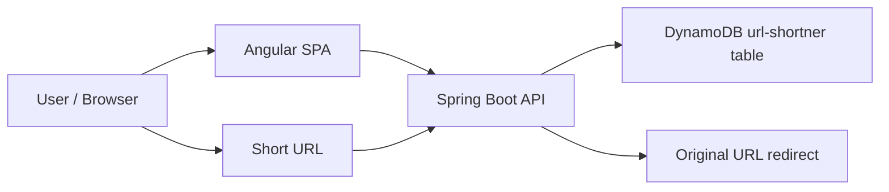

# AGENTS.md

## Technology Stack

- Java 21 backend development
- Spring Boot 3.3.5 REST API development
- AWS Lambda serverless backend
- AWS API Gateway HTTP API
- AWS DynamoDB NoSQL persistence
- AWS SDK for Java v2
- Terraform infrastructure as code
- Angular 21 frontend development
- Angular Material and Angular CDK
- TypeScript
- RxJS
- Docker and Docker Compose
- OpenAPI 3.1 API documentation
- Maven build tooling
- JUnit 5 and Mockito unit testing
- CloudFront and S3 frontend hosting
- AWS IAM, CloudWatch, Route 53, and ACM infrastructure concepts
